# Netbox
a server side network library for photon pun (maybe fusion) and playfab in one simple to use security first api

ik the image doesnt show it but idk what to do without playfab so all the transports have to use playfab as of right now

# Feature List:
- Proper Authentication
- Server Side Authentication
- Secure AppIDs (because of server side auth if they try to use the ids it wont let them connet)
- Secure RPC System 

More Coming
